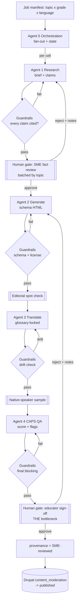

# Classroom AI Agent Pipeline

Owner: issues #438-#443 (agent pipeline + guardrails)
Part of epic #433 (SAHO Classroom). Sibling docs: `10-audit.md` (#434),
`20-content-model.md` (#435), `30-html-framework.md` (#436),
`50-multilingual.md` (#437), `60-delivery.md` (#444-#447),
`70-governance.md` (#448-#451).

Status: design. Nothing here is wired to production yet. This document is the
contract the implementation issues build against.

---

## 1. The core constraint

Generation is cheap. Human review capacity is the bottleneck.

A single Claude call can draft a grade-8 worksheet on the 1976 Soweto uprising
in seconds and for cents. What we cannot scale the same way is a subject-matter
expert (SME) and a CAPS-qualified educator reading, correcting, and signing off
on that worksheet. There are a handful of trusted reviewers and thousands of
topic x grade x language cells to fill.

Every design decision below optimises for reviewer throughput, not model
throughput:

- Agents do the boring precision work (citation stitching, terminology,
  schema conformance, licensing checks) so the human is never fixing
  mechanics, only judging pedagogy and truth.
- Work arrives at the review gate pre-scored and pre-flagged, so a reviewer can
  triage fast: approve the clean 80 percent, spend real attention on the flagged
  20 percent.
- The pipeline batches by topic spine so a reviewer signs off a coherent unit
  (one topic, one grade, all artifacts) in one sitting rather than context
  switching across unrelated fragments.
- Rejections are cheap to recycle: a rejected draft carries structured reviewer
  notes back into a targeted regeneration, not a from-scratch rerun.

Design rule of thumb: aim for a >=5:1 ratio of machine-prepared, auto-verified
output to human decisions. If a stage forces the reviewer to hand-check
something a machine could have checked, that is a pipeline bug.

---

## 2. Agents at a glance

| # | Agent | Issue | Purpose | Model tier | Human gate |
|---|-------|-------|---------|-----------|------------|
| 1 | Research and modernisation | #438 | Source-cited briefs from SAHO corpus + fact-check | High (Opus) | SME fact review (batched) |
| 2 | Presentation generation | #439 | Brief + slide schema -> HTML deck / worksheet | Mid (Sonnet) | Light editorial (spot) |
| 3 | Translation + terminology | #440 | EN -> target langs, glossary-locked | Mid (Sonnet) | Native-speaker spot check |
| 4 | Pedagogical + CAPS QA | #441 | CAPS alignment + reading-level + rubric scoring | High (Opus) | Educator sign-off (the real gate) |
| 5 | Orchestration | #442 | Fan-out, state, moderation integration | n/a (control plane) | n/a |
| 6 | Guardrails | #443 | Citation, provenance, licensing enforcement | Mid (Sonnet) + rules | Blocking, pre-gate |

Model tier is a starting point, not a contract. See
[docs referenced by the claude-api skill] for current model ids and pricing
before implementing; do not hard-code model strings from memory. Tiers here mean:

- High = strongest reasoning, used where a wrong answer is expensive to catch
  downstream (fact synthesis, CAPS judgement).
- Mid = fast and cheap, used for transformational work with a schema or glossary
  to constrain it (generation, translation, mechanical guardrail checks).

---

## 3. The topic spine (data contract)

Every stage reads and writes one JSON object, the "topic spine". It is the
single source of truth that travels the pipeline. Each agent appends to it and
never mutates a prior agent's block (append-only provenance). The spine is keyed
by the fan-out coordinate `topic_id x grade x language`.

```jsonc
{
  "spine_version": "1.0",
  "coordinate": {
    "topic_id": "soweto-uprising-1976",   // stable slug, one per curriculum topic
    "grade": 8,                             // 4-12
    "language": "en",                       // ISO 639-1; en is the source language
    "caps_ref": "SS.HIST.G8.T3.U2"          // CAPS unit reference from #435 content model
  },
  "lineage": {
    "source_nodes": [12345, 67890],         // Drupal nids in SAHO corpus this derives from
    "classroom_terms": ["worksheets"],      // taxonomy: classroom vocab
    "field_classroom_categories": [42]      // tid(s)
  },

  // Stage 1 output ------------------------------------------------------------
  "brief": {
    "summary": "...",
    "modernised_narrative": "...",          // rewritten for the target grade reading level
    "learning_objectives": ["...", "..."],
    "claims": [
      {
        "id": "c1",
        "text": "The uprising began on 16 June 1976.",
        "citations": [
          { "source_nid": 12345, "quote": "...", "url": "https://.../node/12345" }
        ],
        "confidence": 0.98,
        "fact_check": "verified"            // verified | uncertain | conflicted | unsupported
      }
    ],
    "open_questions": ["..."],              // things the SME must resolve
    "reading_level_target": "grade-8"
  },

  // Stage 2 output ------------------------------------------------------------
  "artifact": {
    "type": "presentation",                 // worksheet | activity | presentation | video-script | quiz
    "schema_version": "1.0",
    "html": "<section>...</section>",       // conforms to #436 HTML framework
    "slides": [ { "title": "...", "body_claim_ids": ["c1"], "assets": [] } ],
    "assets": [
      { "kind": "image", "media_id": 555, "license": "CC-BY-SA-4.0", "attribution": "..." }
    ]
  },

  // Stage 3 output (one block per non-source language) ------------------------
  "translation": {
    "language": "af",
    "html": "<section>...</section>",
    "glossary_version": "2026-07",
    "untranslated_terms": ["..."],          // proper nouns intentionally left
    "back_translation_check": "pass"        // pass | drift
  },

  // Stage 4 output ------------------------------------------------------------
  "qa": {
    "caps_alignment": { "score": 0.91, "matched_ref": "SS.HIST.G8.T3.U2", "gaps": [] },
    "reading_level": { "measured": "grade-8", "target": "grade-8", "pass": true },
    "pedagogy": { "objectives_covered": true, "assessment_present": true, "notes": "..." },
    "flags": [ { "severity": "warn", "claim_id": "c3", "why": "confidence 0.55" } ],
    "recommendation": "review"              // approve | review | reject
  },

  // Stage 6 (guardrails) writes here, blocking ---------------------------------
  "guardrails": {
    "every_claim_cited": true,
    "uncited_claim_ids": [],
    "license_check": "pass",                // pass | fail
    "license_failures": [],
    "provenance": "AI-drafted"              // AI-drafted | SME-reviewed | published
  },

  // Orchestration / moderation state ------------------------------------------
  "workflow": {
    "state": "needs_sme_review",            // maps to Drupal content_moderation state (see s.7)
    "history": [
      { "stage": "research", "agent_run_id": "...", "at": "2026-07-03T09:00:00Z", "cost_usd": 0.42 }
    ],
    "review": {
      "sme": { "by": null, "at": null, "decision": null, "notes": null },
      "educator": { "by": null, "at": null, "decision": null, "notes": null }
    }
  }
}
```

Contract rules:

1. Append-only. An agent may add its own block and may read any prior block. It
   must not rewrite another agent's block. Corrections happen by regeneration
   (a new run producing a new spine version), not in-place edits.
2. Claims are the atomic unit of truth. Every factual statement rendered in an
   artifact traces to a `claims[].id`. Guardrails enforce that mapping.
3. The `coordinate` is immutable and is the fan-out key. One spine = one cell.
4. Everything a reviewer needs to decide is in the spine. A reviewer never has
   to leave the review screen to find a source or a score.

---

## 4. Agent specifications

### Agent 1 - Research and modernisation (#438)

- Purpose: turn SAHO's existing corpus into a grade-appropriate, source-cited
  brief. "Modernisation" = rewrite dated or dense encyclopedic prose to the
  target reading level and current pedagogical framing without inventing facts.
- Inputs: `coordinate`, `lineage.source_nodes` (full body text pulled read-only
  from Drupal), the CAPS unit descriptor from #435, target reading level.
- Outputs: `brief` block - summary, modernised narrative, learning objectives,
  and a `claims[]` array where every claim carries >=1 citation into a source
  node plus a `fact_check` verdict and `confidence`.
- Tools:
  - Read-only corpus retrieval (JSON:API / a read-only query service over SAHO
    nodes; never writes).
  - Internal retrieval / Solr MLT to find corroborating source nodes beyond the
    seed set.
  - A fact-check pass: each claim is re-checked against retrieved sources; claims
    with no supporting quote are marked `unsupported` and surfaced in
    `open_questions` rather than silently dropped.
- Model tier: High (Opus). This is where a hallucinated date or a fabricated
  quote is most expensive, because everything downstream inherits it.
- Human gate: SME fact review, batched by topic. The SME sees the claim table
  (claim -> citation -> verdict -> confidence) and open questions. They approve,
  edit a claim, or reject with notes. Low-confidence / unsupported / conflicted
  claims are pre-sorted to the top so attention goes where it is needed.

### Agent 2 - Presentation generation (#439)

- Purpose: render an approved brief into a concrete classroom artifact that
  conforms to the #436 HTML framework and the #435 slide/worksheet schema.
- Inputs: `brief` (SME-approved), the artifact `schema` for the requested
  `artifact.type`, the SAHO HTML component vocabulary from #436.
- Outputs: `artifact` block - schema-valid HTML plus a `slides[]`/section map in
  which every rendered block references the `claim_ids` it is built from, and an
  `assets[]` list of proposed media with license metadata.
- Tools:
  - Schema validator (rejects and self-repairs non-conforming HTML before
    emitting).
  - Media selector over SAHO's media library (read-only), returning media_id +
    license + attribution. Never selects unlicensed or unknown-license media.
- Model tier: Mid (Sonnet). The brief already carries the hard reasoning; this
  stage is constrained transformation, so speed and cost win.
- Human gate: light editorial spot check only. Because generation is
  schema-locked and claim-linked, most decks pass. Reviewer effort is reserved
  for stage 4. If a deck fails schema validation, it never reaches a human - it
  loops back for automatic repair.

### Agent 3 - Translation and terminology (#440)

- Purpose: translate the approved English artifact into SA target languages
  (initial set per #437; e.g. Afrikaans, isiZulu, isiXhosa) with a locked
  historical / political terminology glossary so that loaded terms are rendered
  consistently and correctly.
- Inputs: `artifact.html` (source language, post stage-2), the terminology
  glossary version for the target language, a do-not-translate list (proper
  nouns, organisation names, Act titles).
- Outputs: `translation` block per language - translated HTML, glossary version
  used, `untranslated_terms`, and a back-translation drift check.
- Tools:
  - Glossary lookup / enforcement (terms are substituted from a controlled
    vocabulary, not freely translated).
  - Back-translation verifier: translate back to English and diff against source
    claims; large semantic drift is flagged, not shipped.
- Model tier: Mid (Sonnet), with the glossary doing the heavy constraining.
- Human gate: native-speaker spot check, sampled. Full review of every string
  does not scale; instead review is triggered on drift flags and on a random
  audit sample. Terminology errors caught here feed back into the glossary so
  the whole corpus improves.

### Agent 4 - Pedagogical and CAPS-alignment QA (#441)

- Purpose: the quality gate that matters. Score the artifact against the CAPS
  unit, verify reading level, confirm learning objectives are actually taught
  and assessed, and produce a recommendation that routes reviewer attention.
- Inputs: `brief`, `artifact` (and each `translation`), the CAPS unit
  descriptor and outcomes from #435.
- Outputs: `qa` block - CAPS alignment score + matched ref + gaps, measured
  reading level vs target, pedagogy checks, a `flags[]` list, and a
  `recommendation` of approve / review / reject.
- Tools:
  - Reading-level measurement (deterministic readability metric, not model
    opinion, so it is auditable).
  - CAPS rubric scorer (structured comparison of objectives vs curriculum
    outcomes).
- Model tier: High (Opus) for the pedagogical judgement; deterministic tools for
  the measurable parts so scores are reproducible.
- Human gate: educator sign-off. This is the real bottleneck and the pipeline is
  built to protect it: the educator sees a pre-scored artifact with flags ranked
  by severity. `approve` items are a fast confirm; `review` items get real
  attention; `reject` items bounce back with the educator's structured notes for
  targeted regeneration (not a full rerun).

### Agent 5 - Orchestration (#442)

- Purpose: the control plane. Owns fan-out, per-cell state, retries, cost
  accounting, and the handoff into Drupal content moderation. Not a content
  model itself.
- Inputs: a job manifest (list of `coordinate`s to produce), pipeline config
  (which stages, which languages), budget caps.
- Outputs: spine state transitions, a run ledger (cost + latency per stage per
  cell), and moderation-state writes into Drupal at sign-off.
- Tools: a Workflow / task fan-out engine (see section 6), a state store for
  spines, the Drupal moderation API (write only at gates, and only after human
  sign-off).
- Model tier: none - this is code, not a model. Determinism here is a feature.
- Human gate: none directly; it enforces everyone else's gates and will not
  advance a cell whose gate has not been cleared.

### Agent 6 - Guardrails (#443)

- Purpose: non-negotiable, blocking checks that run before every human gate and
  again before publish. Guardrails cannot be skipped and their failure blocks
  progression regardless of any score.
- Inputs: the full spine at the current stage.
- Outputs: `guardrails` block - pass/fail on each rule plus the provenance stamp.
- Rules (all blocking):
  1. Citation on every claim. Any `claims[]` entry, or any rendered block that
     references a claim, with zero citations fails the cell. `uncited_claim_ids`
     must be empty to pass.
  2. Provenance metadata. Every artifact carries a provenance value that can only
     move forward: `AI-drafted` -> `SME-reviewed` -> `published`. The stamp is
     written by the orchestrator on human sign-off, never by a content agent.
  3. Image and text licensing. Every asset must carry a known, permissive
     license and attribution. Unknown or incompatible license = fail. Text reuse
     from sources beyond fair quotation is flagged.
- Model tier: Mid (Sonnet) for the fuzzy checks (e.g. "is this block actually
  supported by its cited quote"), backed by deterministic rules for the
  structural checks (citation presence, license enum, provenance monotonicity).
- Human gate: guardrails ARE a gate, but an automated blocking one. They run
  ahead of the human so a reviewer never spends attention on a cell that has an
  uncited claim or an unlicensed image - those are bounced before review.

---

## 5. Pipeline flow

```
                        JOB MANIFEST (topic x grade x language cells)
                                        |
                                        v
                          +-----------------------------+
                          |  Agent 5: Orchestration     |
                          |  fan-out, state, budgets    |
                          +-----------------------------+
                                        |
        per cell (topic_id x grade x language) -- runs in parallel
                                        |
                                        v
   +--------------------+     +----------------------+
   | Agent 1 RESEARCH   | --> | GUARDRAILS (cite?)   | --> [ HUMAN GATE: SME fact review ]
   | brief + claims     |     +----------------------+          |  approve / edit / reject
   +--------------------+                                       |  (batched by topic)
                                        (reject -> regenerate)  v
   +--------------------+     +----------------------+
   | Agent 2 GENERATE   | --> | GUARDRAILS (license, | --> [ light editorial spot check ]
   | schema HTML deck   |     |  schema, provenance) |
   +--------------------+     +----------------------+
                                        |
                                        v
   +--------------------+     +----------------------+
   | Agent 3 TRANSLATE  | --> | GUARDRAILS (drift)   | --> [ native-speaker spot / sample ]
   | per language       |     +----------------------+
   +--------------------+
                                        |
                                        v
   +--------------------+     +----------------------+
   | Agent 4 CAPS QA    | --> | GUARDRAILS (final)   | --> [ HUMAN GATE: educator sign-off ]
   | score + flags +    |     |  every claim cited,  |          |  approve / review / reject
   | recommendation     |     |  license, provenance |          |  (THE bottleneck)
   +--------------------+     +----------------------+          v
                                                       provenance = SME-reviewed
                                                                   |
                                                                   v
                                             +-----------------------------------+
                                             | Drupal content_moderation         |
                                             | draft -> needs_review -> published |
                                             +-----------------------------------+
```

Mermaid version:



---

## 6. Mapping to a fan-out Workflow

The unit of parallelism is the cell: one `topic_id x grade x language`. A
delivery target of, say, 40 topics x 6 grades x 3 languages = 720 cells. The
Workflow fans out one sub-task per cell, and each cell runs the linear
stage sequence above.

Fan-out shape:

```
Workflow: build-classroom-batch
  for topic in topics:                 # e.g. 40
    for grade in grades[topic]:        # CAPS says which grades a topic serves
      # English is produced once per (topic, grade); translations fan out from it
      task = produce_cell(topic, grade, language="en")
      after en cell reaches "generated + editorially ok":
        for language in target_languages:   # e.g. af, zu, xh
          fan_out translate_cell(topic, grade, language)
```

Key fan-out decisions, all driven by the human-review constraint:

- Fan out generation freely; serialise review. Machine stages (1, 2, 3, 4 and
  all guardrails) run massively in parallel. The two human gates are modelled as
  a queue with limited "reviewer slots". The Workflow pre-computes and
  pre-scores everything so that when a reviewer slot opens, the next item is
  fully prepared.
- Batch human work by topic, not by cell. A reviewer is assigned a whole topic
  spine (all grades, source language) in one sitting; translations are sampled,
  not fully re-reviewed. This turns hundreds of tiny decisions into a few
  coherent review sessions.
- English gates before translation fans out. There is no point translating and
  QA-ing a deck the SME will reject. The translation fan-out is deferred until
  the English cell has cleared its editorial check, so a rejected topic does not
  burn translation + review budget across three languages.
- Regeneration is targeted. A reject carries structured notes to exactly the
  stage that must rerun (usually generate or research), reusing every upstream
  approved block. Cells never restart from zero.
- Budget caps per fan-out. The orchestrator holds a per-batch cost ceiling and a
  reviewer-throughput ceiling; it will not generate faster than review can
  consume, to avoid a pile-up of stale, unreviewed drafts.

Priority ordering for the queue: fill high-traffic topics and exam-weighted
grades first (informed by #434 audit + SAHO analytics), so the scarce reviewer
hours land on the cells that reach the most learners.

---

## 7. Drupal content moderation integration

Human sign-off is the only thing that changes moderation state. Agents draft;
people publish.

Suggested state mapping (implemented in a `saho_classroom` module workflow, per
Drupal 11 content_moderation; state names to be finalised with #448-#451
governance):

| Spine `workflow.state` | Drupal moderation state | Set by |
|------------------------|-------------------------|--------|
| `drafting`             | draft                   | orchestrator |
| `needs_sme_review`     | draft (flagged)         | after Agent 1 + guardrails |
| `sme_approved`         | draft                   | SME sign-off |
| `needs_educator_review`| needs_review            | after Agent 4 + guardrails |
| `educator_approved`    | needs_review -> published transition ready | educator sign-off |
| `published`            | published               | orchestrator, only after both gates |
| `rejected`             | draft                   | either reviewer, with notes |

Rules:

- The orchestrator writes moderation transitions only after the corresponding
  human gate is cleared and guardrails pass. No agent may transition a node to
  `published`.
- Provenance metadata is stored as a field on the classroom node
  (`field_content_provenance`: AI-drafted | SME-reviewed | published) and is
  monotonic - it only moves forward. It is rendered on the published page so
  teachers and learners can see the review status ("SME-reviewed").
- The claim -> citation map is persisted (as structured field data or a sidecar
  entity per #435) so citations render on the live artifact and remain auditable
  after publish.
- A published cell that is later re-generated re-enters the workflow at
  `needs_sme_review`; it does not silently overwrite a live, human-approved page.

---

## 8. Guardrail invariants (summary)

These must hold at publish time or the cell cannot publish:

1. Every rendered factual claim has >=1 citation into a SAHO source node (or an
   explicitly SME-approved external source). `uncited_claim_ids == []`.
2. Provenance stamp present and monotonic: `AI-drafted` before any human review,
   `SME-reviewed` after sign-off, `published` only via the orchestrator.
3. Every media asset and any reused text passage carries a known, compatible
   license with attribution. Unknown license = blocked.
4. Reading level within tolerance of the grade target (deterministic metric).
5. CAPS alignment score above threshold with a matched CAPS unit reference.
6. Both human gates (SME fact, educator pedagogy) recorded with reviewer id,
   timestamp, and decision.

Guardrails run automatically before each human gate so reviewers never spend
their scarce attention on cells that fail a mechanical invariant.

---

## 9. Open items for the implementation issues

- #438: define the read-only corpus retrieval service and the claim/fact-check
  schema; decide the confidence threshold that forces `open_questions`.
- #439: pin the artifact schemas per type against #436; wire schema
  self-repair loop.
- #440: seed the terminology glossary per language with #437; define drift
  threshold.
- #441: choose the readability metric and the CAPS rubric scoring method; set
  approve/review/reject thresholds.
- #442: pick the Workflow engine + spine state store; implement reviewer-slot
  throttling and per-batch budget caps.
- #443: implement the blocking guardrail checks and the provenance field +
  render.
- Cross-cutting (governance #448-#451): who are the named SME and educator
  reviewers, what is their weekly slot capacity, and what is the escalation path
  for a contested historical claim.
